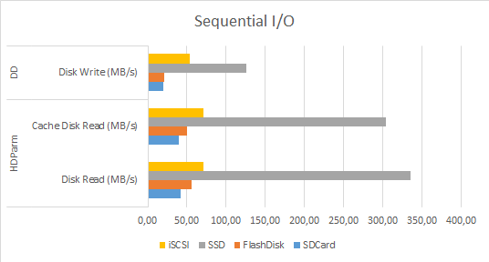
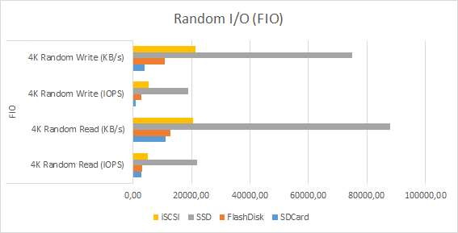
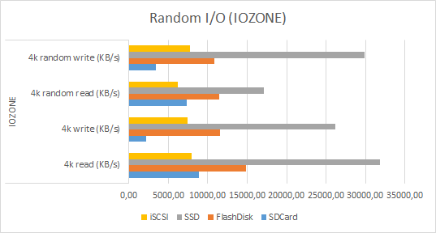
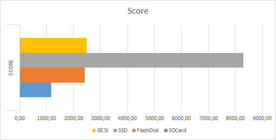

# Pi Storage Benchmarking

## Performance results

Average-metrics obtained during the tests removing the worst and the best result can be found in the next table and the following graphs:

|           | Disk Read (MB/s) | Cache Disk Read (MB/s) | Disk Write (MB/s) | 4K Random Read (IOPS) | 4K Random Read (KB/s) | 4K Random Write (IOPS) | 4K Random Write (KB/s) | 4k read (KB/s) | 4k write (KB/s) | 4k random read (KB/s) | 4k random write (KB/s) | Global Score   |
| --------- | ---------------- | ---------------------- | ----------------- | --------------------- | --------------------- | ---------------------- | ---------------------- | -------------- | --------------- | --------------------- | ---------------------- | ------- |
| SDCard    | 41.89            | 39.02                  | 19.23             | 2767.33               | 11071.00              | 974.33                 | 3899.33                | 8846.33        | 2230.33         | 7368.67               | 3442.33                | 1169.67 |
| FlashDisk | 55.39            | 50.51                  | 21.30             | 3168.40               | 12675.00              | 2700.20                | 10802.40               | 14842.20       | 11561.80        | 11429.60              | 10780.60               | 2413.60 |
| SSD       | 335.10           | 304.67                 | 125.67            | 22025.67              | 88103.33              | 18731.33               | 74927.00               | 31834.33       | 26213.33        | 17064.33              | 29884.00               | 8295.67 |
| iSCSI     | 70.99            | 71.46                  | 54.07             | 5104.00               | 20417.00              | 5349.67                | 21400.00               | 7954.33        | 7421.33         | 6177.00               | 7788.33                | 2473.00 |

### Sequential I/O

### Random I/O (FIO)

### Random I/O (IOZONE)

### Global Score

## Summary

1) Clearly `SSD` with USB3.0 to SATA adapter beats the rest in all performance tests.
2) `SDCard` obtains worst metrics than `FlashDisk` and `iSCSI`
2) `FlashDisk` and `iSCSI` get simillar performance metrics 